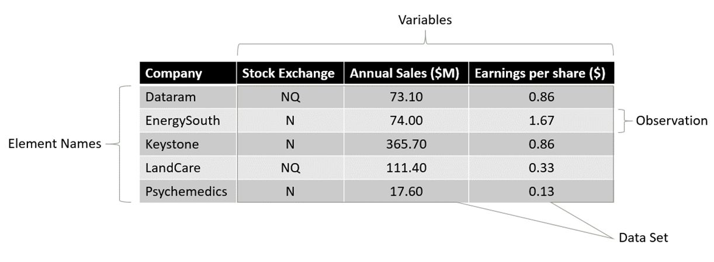

```{r setup, include=FALSE}
library(tufte)
# invalidate cache when the tufte version changes
knitr::opts_chunk$set(cache.extra = packageVersion('tufte'))
options(htmltools.dir.version = FALSE)
```

We see data every day, and yet we often lack the language to 
describe, the concepts to understand, and the tools to interpret those data.
This course aims to provide you with the language, concepts, and tools you 
need to comprehend data and harness their power.

```{marginfigure}
**Data**: 
The facts and figures collected, analyzed, and summarized for presentation
and interpretation. 
```

# Basic Vocabulary


In Figure 1, we see the common vocabulary related to data in action.
**Elements** are the entities on which data are collected. In Figure 1, 
the element is the company, represented by its name. **Variables** are
characteristics of interest for the elements. For example, for each
element (company), variables for Stock Exchange, Annual Sales, and
Earnings per share were collected. An **observation** is the set of 
measurements collected for a particular element. In this case, the row marked
Observation contains the set of measurements (variables) related to the element,
EnergySouth. Finally, **data set** refers to all the data collected for the
particular study. In this case, the data set comprises 5 observations
measuring 3 variables for each element.
\

# Scales of Measurement/Data Types

The **scale of measurement** determines the amount of information contained in 
the data and indicates the most appropriate data summarization and 
statistical analyses.


Scale of    Named    |Ordered  |Proportionate|Absolute|Examples               |
Measurement Variables|Variables|Interval     |Zero    |                       |
----------- -----------------|-------------|--------|-----------------------|
Nominal       Y         N    |     N       |   N    |Gender                 |
-----------------------------|-------------|--------|-----------------------|


```{marginfigure}
**Statistics**: 
The art and science of collecting, analyzing, presenting, and
interpreting data.
```
\
The *central limit theorem* helps us understand how the sample means are
distributed around the population mean.\  
\

\
This worked example outlines two different techniques for calculating the 
standard error of the mean. 

# Standard Error of the Mean (Infinite Population)
  

# Standard Error of the Mean (Finite Population)


# Sampling Distribution


