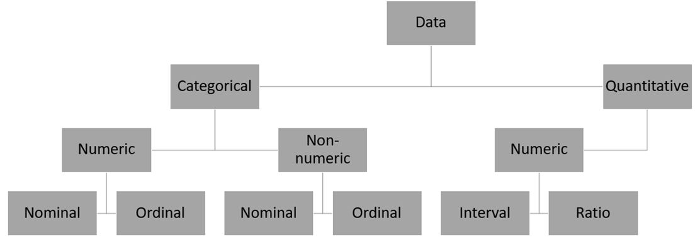

```{r setup, include=FALSE}
library(tufte)
# invalidate cache when the tufte version changes
knitr::opts_chunk$set(cache.extra = packageVersion('tufte'))
options(htmltools.dir.version = FALSE)
```

We see **data** every day, and yet we often lack the language to 
describe, the concepts to understand, and the tools to interpret those data.
This course aims to provide you with the language, concepts, and tools you 
need to comprehend data and harness their power.

```{marginfigure}
**Data**: 
The facts and figures collected, analyzed, and summarized for presentation
and interpretation. 
```

# Basic Vocabulary


```{marginfigure}
**Element**: 
The entity on which data are collected. 
```

```{marginfigure}
**Variable**: 
A characteristic of interest for an element. 
```

```{marginfigure}
**Observation**: 
The set of measurements collected for a particular element. 
```

```{marginfigure}
**Data Set**: 
All collected data for a particular study. 
```

In Figure 1, we see the common vocabulary related to data in action.
**Elements** are the entities on which data are collected. In Figure 1, 
the element is the company, represented by its name. **Variables** are
characteristics of interest for the elements. For example, for each
element (company), variables for Stock Exchange, Annual Sales, and
Earnings per share were collected. An **observation** is the set of 
measurements collected for a particular element. In this case, the row marked
Observation contains the set of measurements (variables) related to the element,
EnergySouth. Finally, **data set** refers to all the data collected for the
particular study. In this case, the data set comprises 5 observations
measuring 3 variables for each element.

# Types of Data and Scale of Measurement

```{marginfigure}
**Categorical Data**: 
Labels or names used to identify an attribute of each element. 
```

```{marginfigure}
**Quantitative Data**: 
Numeric values that indicate how much or how many of something of interest. 
```

Variables use different kinds of numbers to identify or measure attributes.
Consider two different types of numbers related to athletes. In many sports,
athletes wear jerseys to identify them from other players on the field. Jersey
numbers are labels that identify particular players. Compare a jersey number
to an athlete's performance statistics or height measurements. Where the 
jersey number is a label, an athlete's height is a proper quantitative 
measurement. Variables such as jersey number are referred to as 
**categorical variables** ; those like height are referred to 
as **quantitative variables**.


While the distinction between categorical and quantitative variables is 
useful, data analysts and statisticians often require more precision
when considering how to responsibly use variables.
The **scale of measurement** determines the amount of information contained in 
the data and indicates the most appropriate data aggregation and 
statistical analyses. Table 1 summarizes the scales of measurement, their 
properties, and examples.

```{marginfigure}
**Nominal Scale**: 
The scale of measurement for a variable when the data are labels or names
used to identify an attribute of an element. 
```

```{marginfigure}
**Ordinal Scale**: 
The scale of measurement for a variable if the data exhibit the properties
of nominal data and the order or rank of the data is meaningful. 
```

```{marginfigure}
**Interval Scale**: 
The scale of measurement for a variable if the data demonstrate the properties
of ordinal data and the interval between values is expressed in terms of a
fixed unit of measure. 
```

```{marginfigure}
**Ratio Scale**: 
The scale of measurement for a variable if the data demonstrate all the 
properties of interval data and the ratio of two values is meaningful. 
```

```{r, fig.fullwidth=TRUE, echo=FALSE}
df <- data.frame(c("Nominal","Ordinal","Interval","Ratio"),
                 c("Y","Y","Y","Y"),
                 c("N","Y","Y","Y"),
                 c("N","N","Y","Y"),
                 c("N","N","N","Y"),
                 c("Gender","Rankings","Temperature","Ratio"))

names(df) <- c("Scale","Named","Ordered",
                "Proportionate Intervals", "Absolute Zero", "Examples")

knitr::kable(
  df, caption = 'Scales of Measurement'
)
```

Figure 2 summarizes the types of data and scales of measurement in a taxonomy.
The purpose of thinking through the scales of measurement of variables is 
to ensure that apply sound techniques to data with those properties. Consider
the example of athletes again. While taking the average height of basketball or 
volleyball players makes sense, taking an average of the jersey numbers of 
those players makes no sense at all.



# Statistics

When people use the term **statistics** in a general sense, they are often
referring to numerical facts such as averages, medians, and percentages
that help us understand a variety of business and economic situations. In this
class, we use the term more broadly to refer to the art and science of working
with data.  

```{marginfigure}
**Statistics**: 
The art and science of collecting, analyzing, presenting, and
interpreting data.
```

```{marginfigure}
**Descriptive Statistics**: 
Tabular, graphical, and numerical summaries of data.
```

We will study two different types of statistics: **descriptive statistics** and
**inferential statistics**. Most of the statistical information we read in 
media consists of summarized or aggregated versions of data prepared in a 
format suitable for a general audience. For example, data might be summarized
in a table, a graph, or a single numerical value. These are examples of 
descriptive statistics. 

```{marginfigure}
**Population**: 
The set of all elements of interest in a particular study.
```

```{marginfigure}
**Sample**: 
A subset of the population.
```

```{marginfigure}
**Statistical Inference**: 
The process of using data obtained from a sample to make estimates or 
test hypotheses about the characteristics of a population.
```

While most people are familiar with descriptive statistics, 
the tools and techniques of statistical inference are less familiar to the 
typical person. Statistical inference depends on an important distinction
between a **population** and a **sample**. In many cases, we want to collect
data related to a huge number of elements such as the number of people in a 
country. In this example, the number of people in a country is our population,
the set of elements of interest. Collecting data related to a population is
often unfeasible due to cost, time or other practical constraints. For this
reason, we often collect the data of a smaller group of elements, called a 
sample, that sufficiently represents the elements of the population.
Statistical inference gives us tools and techniques to 
infer something about a population based on a relatively small sample
drawn from that population.

# Analytics, Big Data, and Data Mining

```{marginfigure}
**Analytics**: 
The scientific process of transforming data into insight for making better
decisions.
```

```{marginfigure}
**Descriptive Analytics**: 
The set of analytical techniques that decribe what has happened in the past.
```

```{marginfigure}
**Predictive Analytics**: 
The set of analytical techniques that use models constructed from past data
to predict the future or assess the impact of one variable on another.
```

```{marginfigure}
**Prescriptive Analytics**: 
The set of analytical techniques that yeild a best course of action.
```

Statistics has become such an important branch of study that its tools and 
techniques have spread to many fields of study. This evolution has produced a 
number of terms that overlap with statistics such as analytics, big data, and
data mining. **Analytics** is used for data-driven or fact-based decision making.
**Descriptive Analytics** includes a set of analytical techniques for describing
what ha happened in the past. Data queries, reports, descriptive statistics, 
data visualization, data dashboards and what-if models are all examples of 
descriptive analytics. **Predictive Analytics** develops models for predicting
future results from past data. For example, past data on sales can be used to 
predict future sales. **Prescriptive Analytics** develops models yielding the
best course of action to take. For example, the airline industry develops
models that recommend a pricing strategy across all flights to maximize 
company revenue.

```{marginfigure}
**Big Data**: 
A set of data that cannot be managed, processed, or analyzed with commonly
available software in a reasonable amount of time.
```

```{marginfigure}
**Data Mining**: 
The process of using procedures from statistics and computer science to extract
useful information from extremely large databases.
```

Given cell phones, IoT devices, point-of-sale systems, bar code scanners, and
many other types of data collection devices, we produce enormous amounts of 
data. We collect so much data that we often have difficulty knowing how to 
effectively and efficiently use those data. These large complex data sets are
referred to as **big data**. What sets big data apart is its volume, 
velocity, and variety. The volume of big data sets are typically measured 
in terabytes. The printed collection of the Library of Congress has 
been estimated at roughly 10 Terabytes. The velocity of big data sets refers
to the speed at which data are collected. The variety of big data sets refers 
to the many different types of data we now collect: video, voice, text, 
spatial, and graphics. **Data mining** focuses on techniques for processing and
learning from very large databases.
